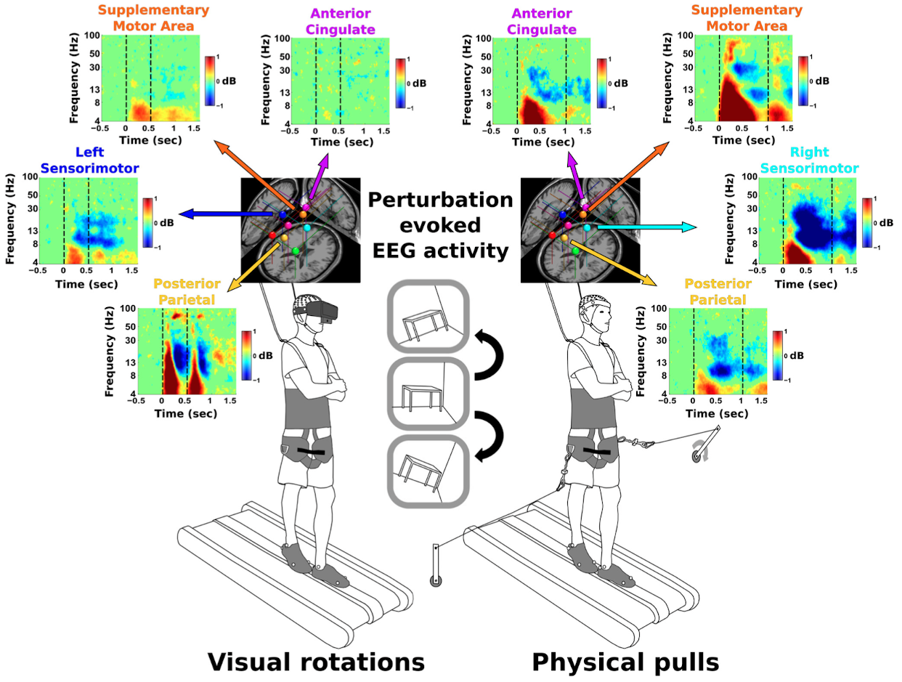

# Analysis of high-density EEG and concurrent EMG/EOG datastreams during balance perturbations

This code was developed to replicate results from our [eNeuro publication](https://www.ncbi.nlm.nih.gov/pmc/articles/PMC6088363/) when used in conjunction with our public [OpenNeuro dataset](https://openneuro.org/datasets/ds003739/). If you find this code and/or dataset useful, please cite our paper.

```
Peterson, S. M., & Ferris, D. P. (2018). Differentiation in theta and beta electrocortical
activity between visual and physical perturbations to walking and standing balance.
ENeuro, 5(4). https://doi.org/10.1523/ENEURO.0207-18.2018
```

## Dataset overview

Our dataset includes synchronized 128-channel high-density electroencephalography (EEG), 2 neck electromyography (EMG) channels, 8 lower leg EMG channels, 3 EOG channels, and 2 load cell recordings of mediolateral pull perturbations. The data was collected for 30 healthy young adult participants (15 males, 15 females). Each participant was exposed to either visual field rotations or mediolateral pull perturbations while either standing or walking, resulting in 4 conditions of 10 minutes each.





## Reproducing our eNeuro results

The code included in the *plot_fxns* folder will recreate Figs 2-11 of our eNeuro results, including the event-related spectral perturbation (ERSP) plots. Below are the specific scripts used to replicate the results of each figure in the paper. Each script will recreate a figure from the paper directly from the OpenNeuro dataset without needing to save intermediate files (unless *eeg_denoise.m* is used; see the second caveat below).

### Caveats

While the scripts below do replicate most of the results from the paper, there are two important differences between the original analysis and the one presented here.

1) The non-EEG recordings have been synchronized directly to the EEG data for this public dataset. This syncing procedure uses a 2 Hz square wave signal and does not include non-EEG recordings, such as EMG and body position, outside of the first/last sync signal. In contrast, our original analysis involved syncing the events separately to each datastream, which was more tedious but included non-EEG data for all events, even those occurring before the sync signal start. Basically, there are some differences at the beginning/end of each condition for the non-EMG data, which is why the code to replicate Figure 6 looks slightly different from its counterpart in our original paper.

2) The EEG data in our OpenNeuro dataset has not been processed to remove noise from neck muscle activity. Also, noisy channels have not been removed. The scripts to replicate our original EEG results still show reasonable similarities, but would align better if our signal denoising workflow was used. This denoising procedure can be implemented by running *eeg_denoise.m* in the *denoise_eeg* directory.

### Specific scripts for replicating eNeuro figures

All plotting scripts are located in the *plot_fxns* directory. Examples of the final plots for each script can be found in the *plt_figs* directory.

- Figure 2: Clustered EEG dipole locations: **plt_cluster_dipole_locs.m**

- Figure 3: Event-related body position: **plt_mocap_event_related.m**

- Figure 4: Average body sway for each condition: **plt_marker_sd.m**

- Figure 5: Event-related lower leg EMG: **plt_emg_event_related.m**

- Figure 6: Early/late pull force, peak EMG, and body sway: **plt_early_late_behavior.m**

- Figure 7-10: EEG power spectra, ERSPs, and ERSP onsets: **plt_eeg_ersps.m** (plots results for a single cluster)

- Figure 11: Neck EMG power spectra and ERSPs: **plt_neck_emg_ersps.m**
